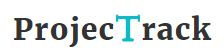
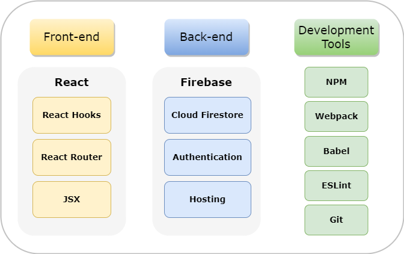
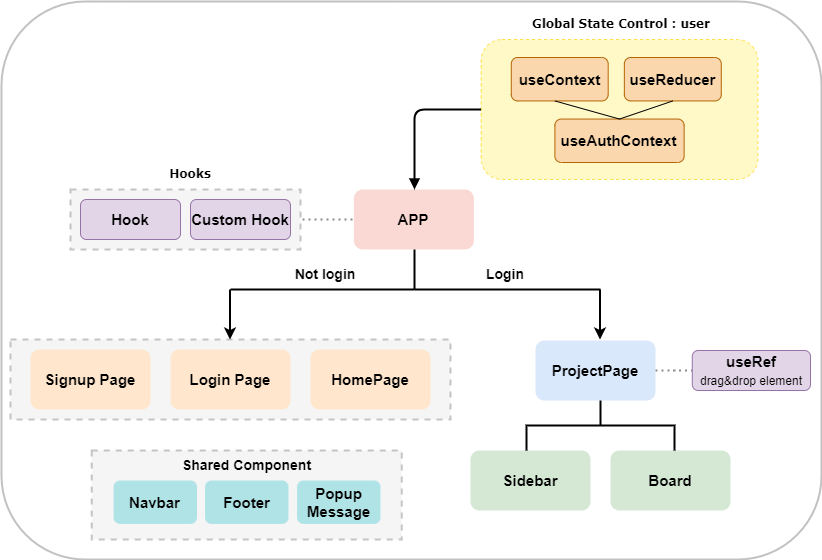
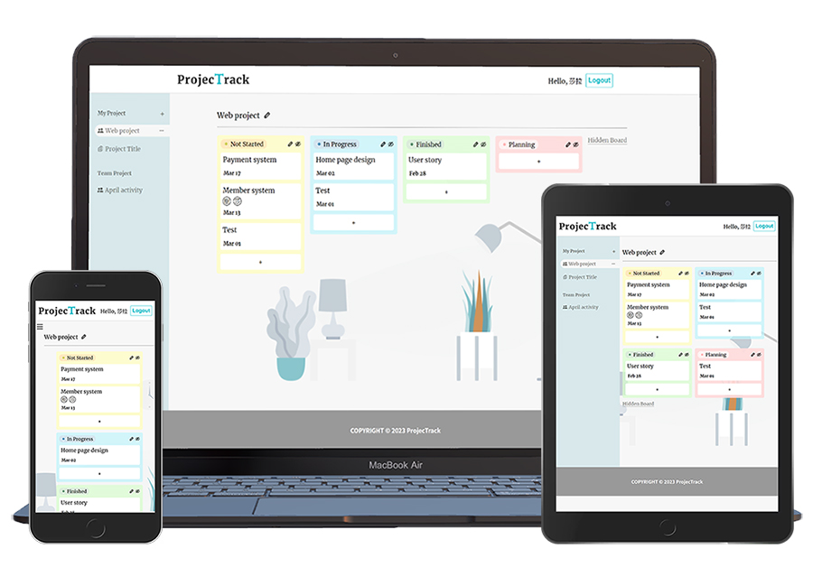
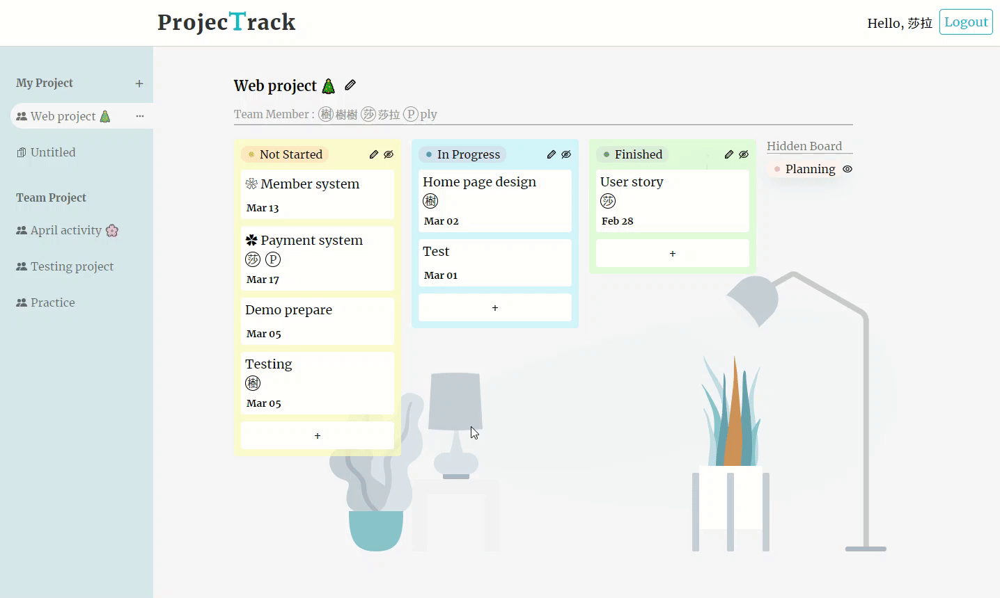
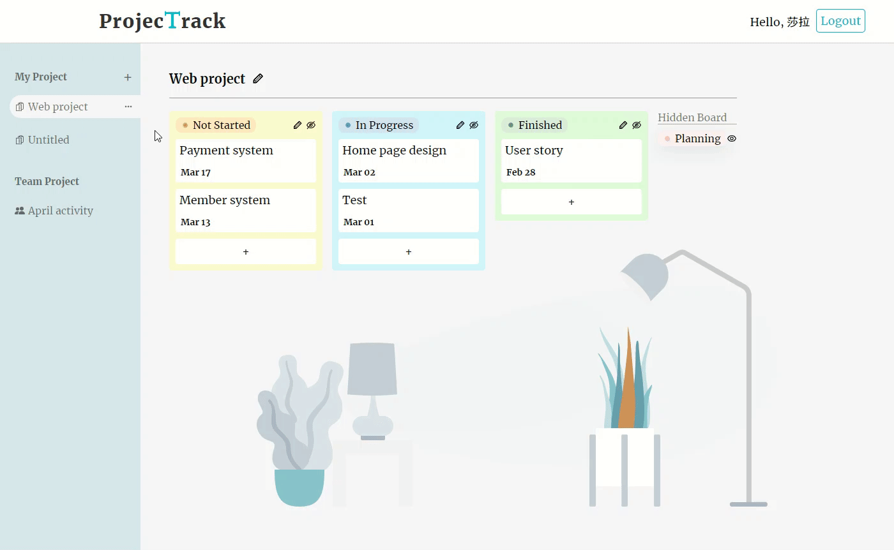
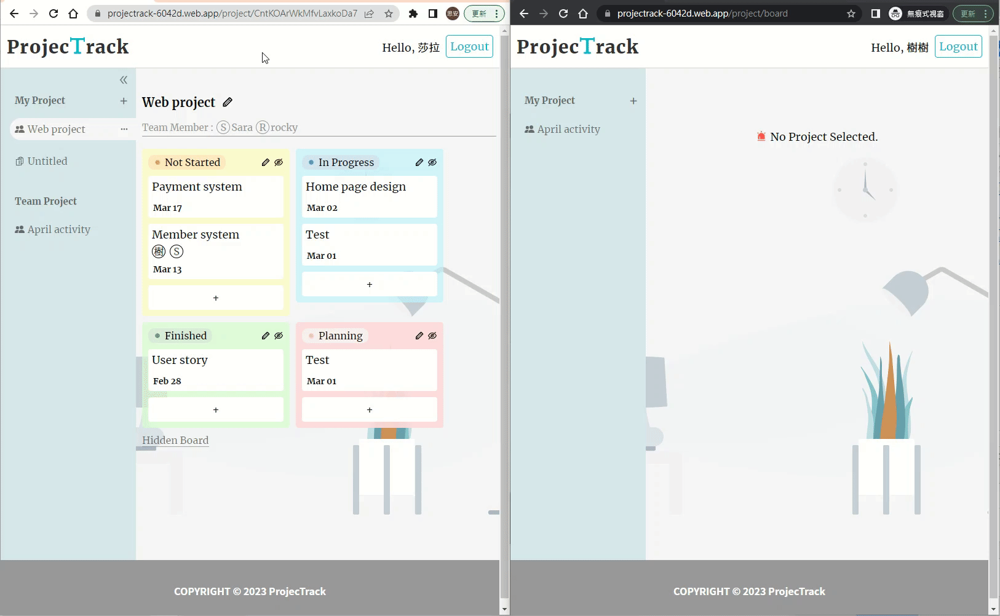

# ProjecTrack

ProjecTrack is a website which can record and track project progress. User can use it to manage not only personal project but also team project.

:link: Website URL: https://projectrack-6042d.web.app/

## Table of Content

- [Development Structure](#Development-Structure)
- [Frontend Technique](#-Frontend-Technique)
  - [Component Structure](#Component-Structure)
  - [React Router](#React-Router)
  - [Hook Api](#Hook-Api)
  - [Custom Hook](#Custom-Hook)
  - [Webpack & Babel](#Webpack--Babel)
  - [Responsive Web Design](#Responsive-Web-Design)
- [Back-end Technique (Firebase Cloud Services)](#-back-end-technique-firebase-cloud-services)
  - [Firebase Authentication](#firebase-authentication)
  - [Cloud Firestore](#cloud-firestore)
  - [Firebase Hosting](#firebase-hosting)
- [Main Features](#-main-features)
- [Contact](#contact)

## Development Structure

The frontend development of ProjecTrack is based on **React** and employs **React Router** to enable a **Single Page Application (SPA)** design. The backend is powered by **Firebase**, which is used to create the website, database, and member system. The development tools used include **Webpack** for module bundling, **Babel** for ensuring compatibility of JavaScript across different environments, **NPM** for package management, **ESLint** for syntax checking and enforcing coding standards, and Github for version control using **Git**.

## ✦ Front-end Technique

### Component Structure

### React Router

- Version 6
- Manage the routing for the Single Page Application (SPA)

### Hook Api

- `useContext`,`useReducer`,`useRef`,`useState`,`useEffect`

### Custom Hook

- Creating a custom hook to separate formulas
  - `useAuthContext`
  - `useSignup`
  - `useLogin`
  - `useLogout`
  - `useAddProject`
  - `useCollection`
  - `useDocument`
  - `useFetchUser`
  - `useUpdateData`

### Webpack & Babel

- Webpack : A module bundler used for JavaScript applications.
- Babel : A transpiler that supports different versions of JavaScript.

### Responsive Web Design

## ✦ Back-end Technique (Firebase Cloud Services)

### Firebase Authentication

- Support Google login and users' email & passwords sign up.

### Cloud Firestore

- To store all project's detail content.

### Firebase Hosting

- Hosting static and dynamic content of the web.

## ✦ Main Features

### Drag and drop (without third party library)

- By using draggable attribute on elements that can be dragged and dropped to different site.

### Team up the project

- You can assign team members to manage the project together.

### Protect your project from unauthorized access

- Non-team members can't view project through the link.

## Contact

- 🐣 Szu-An, Chen
- 📧 Email: k890244@gmail.com
